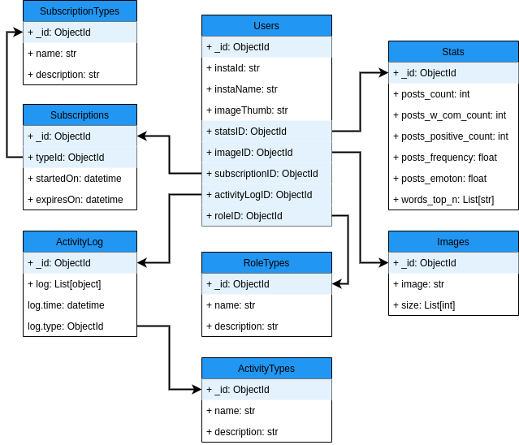

# Описание базы данных

Для хранения данных было решено использовать NoSQL базу данных MongoDB.

## Почему MongoDB

В качестве основной базы было решено использовать NoSQL базу, так как, в данном случае такой подход несёт ряд преимуществ:

- **Гибкая схема:** Позволяет легко изменять схему, что ускоряет разроботку прототипа приложения
- **Отсутствие миграций:** вытекает из пердыдущего факта и позволяет значительно сократить время разработки
- **JSON в качестве формата данных** позволяет легко создавать объекты в объектно-ориентированных языках напрямую из документа базы.
- **Компактность** документов также позволяет быстро и удобно работать с базой

## Схема



## Описание коллекций

### Users

В коллекции Users хранится информация о пользователях

```jsonc
{
    _id: ObjectId,            // _id объекта

    instaId: str,             // id пользозователя в Instagram
    instaName: str,           // имя пользозователя в Instagram
    imageThumb: str,          // превью аватарки (Base64)

    statsId: ObjectId,        // _id статистики пользователя
    imageId: ObjectId,        // _id аватарки
    subscriptionId: ObjectId, // _id подписки
    activityLogId: ObjectId,  // _id лог действий пользователя
    roleId: ObjectId,         // _id типа роли
}
```

### Stats

В коллекции Stats хранится информация о постах пользователя

```jsonc
{
    _id: ObjectId,             // _id объекта

    posts_count: int,          // Общее количество постов
    posts_w_com_count: int,    // Количество постов с комментариями
    posts_positive_count: int, // Количество позитивных постов
    posts_frequency: int,      // Частота постов
    posts_emotion: float,      // Средняя эмоциональная окраска постов
    words_top_n: [             // N часто используемых слов
        str
    ]
}
```

### Images

В коллекции Images хранятся изображения

```jsonc
{
    _id: ObjectId, // _id объекта

    image: str,    // изображение (Base64)
    size: [        // размеры изображения
        int
    ]
}
```

### Subscriptions

В коллекции Subscriptions хранятся информация о подписках

```jsonc
{
    _id: ObjectId,       // _id объекта
    typeId: ObjectId,   // _id типа подписки

    startedOn: datetime, // время начала подписки
    expiresOn: datetime  // время истечения срока подписки
}
```

### SubscriptionTypes

В коллекции SubscriptionTypes хранятся описания типов подписок

```jsonc
{
    _id: ObjectId,    // _id объекта

    name: str,        // имя типа подписки
    description: str  // описание типа подписки
}
```

### ActivityLog

В коллекции ActivityLog хранятся записи о действиях пользователя

```jsonc
{
    _id: ObjectId,          // _id объекта

    log: [
        {
            time: datetime, // время действия
            type: ObjectId  // _id типа действия
        }
    ]
}
```

### ActivityTypes

В коллекции ActivityTypes хранятся описания типов действий

```jsonc
{
    _id: ObjectId,    // _id объекта

    name: str,        // имя типа действия
    description: str  // описание типа действия
}
```

### RoleTypes

В коллекции RoleTypes хранятся описания типов подписок

```jsonc
{
    _id: ObjectId,    // _id объекта

    name: str,        // имя роли
    description: str  // описание роли
}
```
